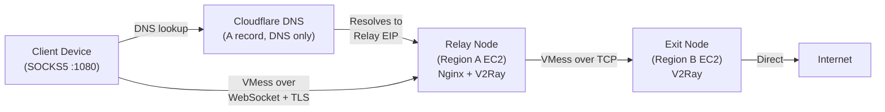
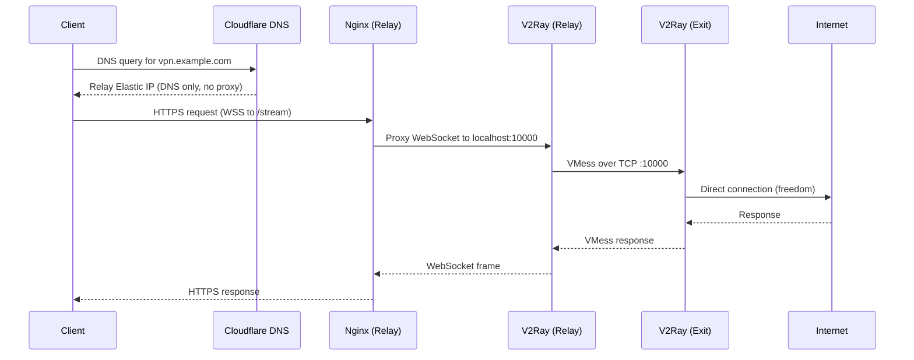

# Architecture

## Dual-Hop VPN Topology

Traffic flows through two hops before reaching the open internet,
adding a layer of indirection between the client and the destination.

## Component Roles

| Component | Purpose |
|-----------|---------|
| **Nginx** | TLS termination on the relay node. Serves a static decoy page at `/` and proxies WebSocket traffic at `/stream` to V2Ray. |
| **V2Ray (relay)** | Accepts VMess-over-WebSocket from the client, forwards all traffic to the exit node via VMess-over-TCP. |
| **V2Ray (exit)** | Receives forwarded traffic from the relay and egresses to the internet via the `freedom` protocol. |
| **Certbot** | Obtains and auto-renews TLS certificates from Let's Encrypt using Cloudflare DNS-01 challenge. |
| **Cloudflare DNS** | Resolves the domain to the relay node's Elastic IP. Must be set to **DNS only** (grey cloud) so traffic goes directly to EC2 rather than through the Cloudflare proxy. Also provides the API for Certbot's DNS-01 challenge. |
| **Terraform** | Provisions both EC2 instances, Elastic IPs, security groups, and triggers remote provisioning scripts. |

## Network Flow

## AWS Resources

- **2x EC2 t3.micro** instances (one per region)
- **2x Elastic IPs** for stable addressing
- **2x Security Groups** with least-privilege ingress rules
- **1x TLS Key Pair** generated by Terraform (shared for SSH access)
